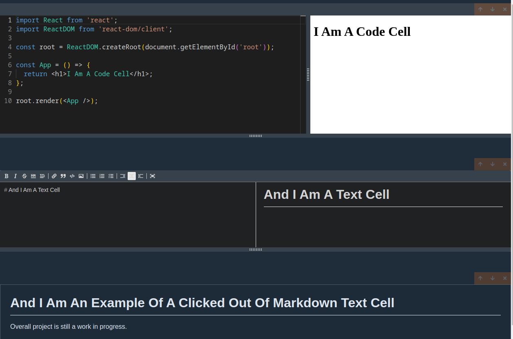

# Interactive Coding Environment

<sub>**_Note:_** I will reorganize docs later</sub>

React application that is able to locally (on the user's personal machine) create text
cells and code cells with a preview window beside each cell through the use of the Monaco
editor. Multiple programming languages will be able to be configured into this environment (currently only `jsx` and `css` files).



<details>
<summary>
<h2 style="display: inline-block;">Steps of Completed Application</h2>
</summary>

1. Run command to start application (<em>e.g.</em>, `jbook serve`)
   - This should start a server on something like `localhost:4005`
2. User will write code into an editor
3. App bundles code in the browser
4. Execute user's code in an `iframe` with `sandbox="allow-scripts"`

### Downside

Some in-browser features will not be accessible to the user's code
(<em>e.g.</em>, `localStorage.getItem("something")` will not work) due to the use of the combination of
`srcDoc` and `sandbox` in the `iframe`.

</details>

<details>
  <summary>
    <h2 style="display: inline-block;">Challenges</h2>
  </summary>

1.  Code will be provided to Preview as a string. This string must be executed safely.
2.  This code might have advanced JavaScript in it (<em>e.g.</em>, JSX) that the browser
    cannot execute.

    - will need to use a transpiler, like Babel. For this app, we can:
      - setup a backend server to transpile the sent code
      - use an in-browser transpiler

3.  The code might have import statements for other JavaScript or CSS files. These
    import statements must be dealt with <em>before</em> executing the code.
    - will need to find all the modules the user has imported from NPM

### Transpiling & Bundling Locally

- Removes an extra request to the API server (which means faster code execution).
- An API server will not have to be maintained.
- Less complexity - no moving code back and forth.

This calls for webpack needing to built into the react app with a custom plugin to
fetch individual files from NPM.

#### Problem with bundling locally is that webpack does NOT work in the browser.

Solve webpack problem by using a webpack and babel replacement called
[esbuild](https://esbuild.github.io/).

</details>

<details>
  <summary>
    <h2 style="display: inline-block">Esbuild Summary & Use</h2>
  </summary>

Contains:

- build: S => (g(), $.build(S))
- serve: f serve(S, K)
- stop: f stop()
- transform: f transforms(S, K)

`transform` will attempt to execute transpiling on the code that is user provided.

`build` bundles the user provided code. Bundling in the browser requires extra setup.

`build` relies on a file system. If user writes:

```JavaScript
import React from "react";
```

`esbuild` will look for a filesystem that the browser will not have. The app will use a
plugin to intercept the request from `esbuild` for `react` code and send a request to
the NPM Registry to get the URL to `react`.

Running the following in a command line:

```sh
npm view react dist.tarball
```

will return `https://registry.npmjs.org/react/-/react-18.2.0.tgz`. This provides the
`react` source code.

For this app, inside of the tarball is `/package/index.js` which
has the code:

```JavaScript
if (process.env.NODE_ENV === 'production') {
    module.exports = require('./cjs/react.production.min.js');
} else {
    module.exports = require('./cjs/react.development.js');
}
```

`esbuild` will interpret the `require()` statements in order to join the needed files.

To help with getting the above JS code, [UNPKG](https://unpkg.com) will be used
(`unpkg.com/react`) to fetch the above `index.js`.

### Esbuild Bundling Process

To create a bundle in the browser with esbuild, `onResolve` and `onLoad` will need
to be used.

Both `onResolve` and `onLoad` have an object with `filter` that is a regular expression.
The regex controls when `onResolve` & `onLoad` are executed. `onResolve` handles the
different types of files attempting to be loaded.
<em>e.g.</em>, one `onResolve` may have a `filter` for loading a JS file, and another
for loading a CSS file.

The `namespace` is similar to `filter` in that it specifies a set of files. An example
of applying an `onLoad` on only files with a `namespace` of `a`:

```javascript
build.onResolve({...}, async (args: any) => ({ path: args.path, namespace: 'a' }));

build.onLoad({ filter: /.*/, namespace: 'a' }, async (args: any) => {...});
```

|                                      Description                                      |       Step       |
| :-----------------------------------------------------------------------------------: | :--------------: |
|                    Figure out where the `index.js` file is stored                     | `onResolve` step |
|                        Attempt to load up the `index.js` file                         |  `onLoad` step   |
|           Parse the `index.js` file, find any `import`/`require`/`exports`            |                  |
| If there are any `import`/`require`/`exports`, figure out where the requested file is | `onResolve` step |
|                             Attempt to load that file up                              |  `onLoad` step   |

### onResolve

`onResolve` will find where `index.js` is stored. This function overrides esbuild's
natural process of finding out what a file's path is.

Only one `onResolve` function is needed. It can be defined with multiple `if`
statements to determine paths through one `filter`:

```javascript
build.onResolve({ filter: /.*/ }, () => {...});
```

For this application, several `onResolve` functions will have more specific `filter`s:

```javascript
build.onResolve({ filter: /^index\.js$/ }, () => ({ path: "index.js" namespace: "a" }));
build.onResolve({ filter: /^\.{1,2}\// }, (args: any) => ({ path:..., namespace: "a" }));
build.onResolve({ filter: /\.*/ }, (...) => {...});
```

- This first `filter` looks for exactly "index.js"
- The second handles relative paths (<em>i.e.</em>, `./` or `../`, for something like
  `./utils`)
- The last will handle the main file of a module.

</details>

<details>
  <summary>
    <h2 style="display: inline-block">Considerations Around Code Execution</h2>
  </summary>

- User-provided code might throw errors that cause program to crash.
  - Solved if execute user's code is contained in an `iframe`
- User-provided code might mutate the DOM, causing program to crash
  - <em>e.g.</em>, user types in `document.body.innerHTML = '';`, which will wipe out webpage body
  - Solved if `iframe`'s reference pre-installs html framework when user clicks submit
- User might accdentally run code provided by another malicious user
  - Solved if execute user's code in an `iframe` with direct communication disabled
    - Done when setting `sandbox` to anything other than `allow-same-origin`
    - Malicious code cannot be used to obtain security information from parent document

`iframe`s can help isolate code. An `iframe` is an `html` document within another
`html` doucment. `iframs`s can be configured to allow communication between a parent
document and a child document.

#### Direct access between frames is allowed with BOTH of the following:

- The `iframe` element does not have a `sandbox` property, or has a `sandbox="allow-same-origin"` property
- The parent HTML doc and the iframe HTML doc are fetched from the <em>exact same</em> Domain/Port/Protocol (`http` vs `https`)

If `window.a = 1` is run in the parent document and `window.a = 3` is run in the child
document, the parent can access the child's `a` and vice-versa with the following:

For the child document to reach into the parent document:

```javascript
parent.window.a;
// output: 1
```

For the parent document to react into the child document:

```javascript
document.querySelector("iframe").contentWindow.a;
// output: 3
```

**_Note:_** For this app, the `iframe` will use `srcDoc` instead of `src`. `srcDoc` takes a string that will
be generated locally. This way, there will be no different Domain/Port/Protocol because content will not
be fetched.

Inside of a React component:

```javascript
const App = () => {
    // run bundler
    const onClick = async () => {
        const result = await ref.current.build({...});

        setCode(result.outputFiles[0].text);
    }

    const html = `
    <script>{code}</script>
        `;

    return (
        <div>
            <iframe srcDoc={html}></iframe>
        </div>
    );
};
```

The above snippet will have an error when importing packages that contain a closing `script` tag. The error is
due to the string parsed in `srcDoc` terminating the contents of the `script` too soon.

The fix is to refactor the `const html` var's string to have a message event listener and when the code is bundled,
post the message via the `iframe`'s `ref`:

```javascript
const html = `
<html>
  <head></head>
  <body>
    <div id="root"></div>
    <script>
    window.addEventListener("message", (event) => {
        eval(event.data);
            })
    </script>
  </body>
</html>
`

// run bundler
const onClick = async () => {
    const result = await ref.current.build({...});

    // iframe is a ref to the iframe tag
    iframe.current.contentWindow.postMessage(result.outputFiles[0].text, "*");
}
```

</details>

  <table>
    <tr>
      <th>CLI</th>
      <td>
        &#8226; Needs to know how to start up the Local API</br>
        &#8226; Needs to know how to publish a notebook to the Public API
      </td>
    </tr>
    <tr>
      <th>Local Express API</th>
      <td>
        &#8226; Needs to serve up the react app</br>
        &#8226; Needs to be able to save/load cells from a file
      </td>
    </tr>
    <tr>
      <th>Public Express API</th>
      <td>
        &#8226; Needs to serve up the react app</br>
        &#8226; Needs to be able to save/load cells from a database</br>
        &#8226; Needs to handle authentication/permissions/etc.
      </td>
    </tr>
    <tr>
      <th>React App</th>
      <td>
        &#8226; Needs to make its production assets available to <em>either</em> the local API <em>or</em> the public API
      </td>
    </tr>
  </table>
